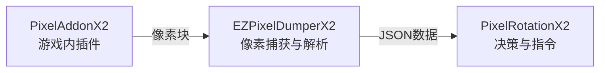

# EZPixelDumperX2

**贼心不死，继续奋斗** 💪

一个用于《魔兽世界》（World of Warcraft）的**游戏数据像素化插件**，通过将游戏内的可收集信息转换为屏幕角落的像素点，让外部程序可以轻松读取并解析为结构化数据。  

## 源起与目的

本项目诞生于一个简单的想法：**在12.0版本中，将秘密值通过像素化的方式传递给外部程序**。  

过去，WoW 的插件 API 提供了丰富的游戏数据，但在最新的游戏更新中，这些数据被限制为"秘密值"，无法被使用。但秘密值可以被编码为屏幕角落的彩色像素块，从而让外部程序通过屏幕捕获获取结构化信息。  

**这不是一个开箱即用的产品，而是一个技术示例。** 代码完全开源，意在展示"像素桥接"这一思路的可行性。如果你认同这个方向，建议在此基础上进行**个性化改造**——调整像素布局、修改数据结构、更换通信方式，让它成为你独有的实现。  

**如何开始？** 推荐使用 **vibe coding** 的方式：借助 AI 编程工具（如 Cline、Trae、Kimi Code、Qoder 等），让 AI 协助你理解代码逻辑并对本项目进行轻量级重构。即使你不是专业开发者，也可以通过自然语言描述需求，快速生成符合自己习惯的代码变体，从而消除本项目的可识别特征。  

项目采用 **Dumper + HTTP API** 的架构设计：Dumper 负责像素捕获与解析，通过本地 HTTP 服务（默认端口 65131）以 JSON 格式输出数据。这种解耦设计让你可以用任何熟悉的语言（Python、C#、Lua 等）独立开发后续的 Rotation 逻辑。  

## 设计

[布局](https://1drv.ms/x/c/cad4d177ae3e2847/IQBWpPl3hgdIRIob6BQ6XbalAVZeY_LFzo9wHgzioLq6kDc?e=Z5yO1t)


### 系统架构



---

### PixelAddonX2效果


### EZPixelDumperX2效果


---

## ⚠️ 免责声明⚠️

1. **切勿直接使用**：本项目的代码特征明显，如果大量用户使用完全相同的代码，极易被游戏反作弊系统检测并导致**账号封禁**。  
2. **必须个性化修改**：强烈建议您根据自身需求对代码进行修改和定制。调整像素布局、数据结构或通信方式，使其具备独特性。  
3. **抛砖引玉，非开箱即用**：本项目旨在展示"将游戏数据转换为像素块并通过外部程序解析"的技术思路，而非提供可直接投入使用的产品。  
4. **自行承担全部风险**：任何基于本项目的二次开发、修改或使用行为，均由您自行承担一切后果（包括但不限于账号封禁、数据损失等）。  
5. **禁止商用与损害公平**：不得将本项目用于任何商业用途，或开发损害游戏公平性的外挂/自动化工具。  

---

## ⚠️ Disclaimer⚠️

1. **Do Not Use Directly**: This project's code has distinctive characteristics; if a large number of users use exactly the same code, it is highly likely to be detected by the game's anti‑cheat system and result in **account suspension**.
2. **Personalization Required**: It is strongly recommended that you modify and customize the code according to your own needs. Adjust pixel layouts, data structures, or communication methods to make it unique.
3. **A Spark for Ideas, Not Out‑of‑the‑Box**: This project aims to demonstrate the technical concept of "converting game data into pixel blocks and parsing them via external programs," not to provide a ready‑to‑use product.
4. **Assume All Risks**: Any secondary development, modification, or use based on this project is entirely at your own risk (including but not limited to account suspension, data loss, etc.).
5. **No Commercial Use or Fair‑Play Harm**: This project must not be used for any commercial purposes, nor for developing cheats/automation tools that undermine game fairness.

## 使用方法

### 1) 基础环境安装（从 `uv sync` 开始）

1. 安装 Python `3.12` 与 `uv`。
2. 在项目根目录执行：

   ```powershell
   uv sync
   ```

### 2) 启动与访问 API

1. 启动 GUI Dumper：

   ```powershell
   uv run python src/DumperGUI.py
   ```

2. 在界面中选择显示器并点击“启动”，确保已在游戏画面中显示标记。
3. 通过浏览器或任意 HTTP 客户端访问：

   - `http://127.0.0.1:65131`

### 3) 可选检查与打包

- 运行基础测试：

  ```powershell
  uv run python src/test_script.py
  ```

- 打包可执行文件（依赖 Nuitka）：

  ```powershell
  uv run python src/deploy.py
  ```

## 文档阅读顺序（已修正）

1. `REBUILD.md`：跨语言通用思路与重构方向。
2. `COLOR.md`：颜色编码与协议映射说明。
3. `EZPixelDumperX2Wiki.md`：实战经验与工程取舍。
4. `src/` 关键文件：`MainWindow.py`、`Worker.py`、`Node.py`、`NodeExtractorData.py`、`Database.py`。

## `src/` 代码速览

- `MainWindow.py`：GUI 主流程，管理设备选择、抓图线程、日志与数据展示。
- `Worker.py`：`CameraWorker` 负责 DXCam 抓帧；`WebServerWorker` 负责 Flask API（默认 `65131`）。
- `Node.py`：`PixelBlock`/`Node`/`NodeExtractor`，实现 8x8 节点切片、亮度/纯色/哈希与序列解析。
- `NodeExtractorData.py`：把节点协议组装成统一 JSON（player/target/focus/party/signal/spec）。
- `Database.py`：图标标题库（SQLite）与哈希命中 + 余弦相似度回退匹配。
- `Utils.py`：模板匹配与锚点定位，计算有效数据区域边界。

## 经验总结（整合自 `EZPixelDumperX2Wiki.md`）

### 1) 截图方案取舍：稳定优先

- `Desktop Duplication API`：约 `100 FPS`，帧率可控、链路稳定，但不能抓取被遮挡窗口。
- `Windows.Graphics.Capture`：约 `160 FPS`，可抓遮挡窗口，但速度不可控，后处理压力更大。
- `GDI`：约 `15 FPS`，实现简单但性能不足。
- 工程上优先选择节奏稳定、可控帧率的方案，避免采集线程与解析线程互相拖拽。

### 2) 主通路统一为 `ndarray`

- 模板匹配、亮度计算、纯色判断、白点计数、相似度计算全部走 `numpy` 通路。
- 减少格式来回转换，提升吞吐并简化代码维护。

### 3) 图标哈希选 `xxhash`

- 使用 `xxh3_64_hexdigest` 计算节点中间 `6x6` 哈希。
- 先 O(1) 哈希命中，未命中再走余弦相似度，兼顾速度与鲁棒性。

### 4) Dumper 与 Rotation 解耦

- Dumper 专注“抓图 + 解析 + JSON 输出”，保持稳定频率。
- Rotation 负责策略决策，通过本地 HTTP 对接，避免决策逻辑反向拖慢采集链路。
- Dumper 内部也分层：`CameraWorker` 抓帧，`WebServerWorker` 提供 API，UI 线程专注交互。

### 5) 抗干扰：先校验再解析

- 每帧先做锚点/参考位校验，失败即返回带 `error` 的 JSON，不输出脏数据。
- 关键校验点：`(1,16)`、`(50,1)` 黑色；`(1,1)` 与 `(50,16)` 纯色且同色；`(51,4)` 非纯色；闪烁位黑白稳定。

### 6) 实用工程细节

- 互斥锁保证单实例运行，避免设备被多开抢占。
- API 使用 catch-all 路由，调用端接入更简单。
- `pixel_dump` 常驻内存对象，服务端读取开销低。

### 7) 采集卡输入可行，但有前提

- 可用 `cv2.VideoCapture('/dev/videoX')` 读取帧并转为 RGB 后复用现有解析链路。
- 尽量使用高性能 `RGB24` 原始链路，避免 H.264/H.265 压缩破坏像素特征。
- 采集卡整体帧率通常受视频源刷新率限制（常见上限 `60Hz`）。

### 8) Node 可用区域应收缩

- 标准 `8x8` Node 的稳定识别区域是中间 `6x6`。
- 队友 `4x4` 子区域有效信息进一步缩到 `2x2`。
- 边缘像素易受抗锯齿影响，不宜参与哈希与关键识别；图标最小设计建议保持 `8x8`。
