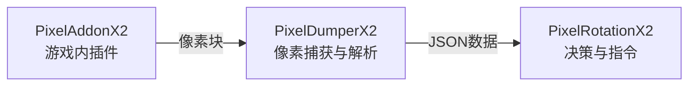

# PixelDumperX2 

**贼心不死，继续奋斗** 💪 

一个用于《魔兽世界》（World of Warcraft）的**游戏数据像素化插件**，通过将游戏内的可收集信息转换为屏幕角落的像素点，让外部程序可以轻松读取并解析为结构化数据。  

## 源起与目的

本项目诞生于一个简单的想法：**在12.0版本中，将秘密值通过像素化的方式传递给外部程序**。  

过去，WoW 的插件 API 提供了丰富的游戏数据，但在最新的游戏更新中，这些数据被限制为"秘密值"，无法被使用。但秘密值可以被编码为屏幕角落的彩色像素块，从而让外部程序通过屏幕捕获获取结构化信息。  

**这不是一个开箱即用的产品，而是一个技术示例。** 代码完全开源，意在展示"像素桥接"这一思路的可行性。如果你认同这个方向，建议在此基础上进行**个性化改造**——调整像素布局、修改数据结构、更换通信方式，让它成为你独有的实现。  

**如何开始？** 推荐使用 **vibe coding** 的方式：借助 AI 编程工具（如 Cline、Trae、Kimi Code、Qoder 等），让 AI 协助你理解代码逻辑并对本项目进行轻量级重构。即使你不是专业开发者，也可以通过自然语言描述需求，快速生成符合自己习惯的代码变体，从而消除本项目的可识别特征。  

项目采用 **Dumper + HTTP API** 的架构设计：Dumper 负责像素捕获与解析，通过本地 HTTP 服务（默认端口 65131）以 JSON 格式输出数据。这种解耦设计让你可以用任何熟悉的语言（Python、C#、Lua 等）独立开发后续的 Rotation 逻辑。  

## 设计

[布局](https://1drv.ms/x/c/cad4d177ae3e2847/IQBWpPl3hgdIRIob6BQ6XbalAVZeY_LFzo9wHgzioLq6kDc?e=Z5yO1t)

项目由多个部分组成

- [PixelAddonX2](https://github.com/liantian-cn/PixelAddonX2) 负责在游戏内生成像素块
- [PixelDumperX2](https://github.com/liantian-cn/PixelDumperX2) 负责像素捕获与解析
- [PixelRotationX2](https://github.com/liantian-cn/PixelRotationX2) 负责解析数据并生成指令

### 系统架构

---

### PixelAddonX2效果

### PixelDumperX2效果

---

## ⚠️ 免责声明⚠️

1. **切勿直接使用**：本项目的代码特征明显，如果大量用户使用完全相同的代码，极易被游戏反作弊系统检测并导致**账号封禁**。  
2. **必须个性化修改**：强烈建议您根据自身需求对代码进行修改和定制。调整像素布局、数据结构或通信方式，使其具备独特性。  
3. **抛砖引玉，非开箱即用**：本项目旨在展示"将游戏数据转换为像素块并通过外部程序解析"的技术思路，而非提供可直接投入使用的产品。  
4. **自行承担全部风险**：任何基于本项目的二次开发、修改或使用行为，均由您自行承担一切后果（包括但不限于账号封禁、数据损失等）。  
5. **禁止商用与损害公平**：不得将本项目用于任何商业用途，或开发损害游戏公平性的外挂/自动化工具。  

---

## ⚠️ Disclaimer⚠️

1. **Do Not Use Directly**: This project's code has distinctive characteristics; if a large number of users use exactly the same code, it is highly likely to be detected by the game's anti‑cheat system and result in **account suspension**.
2. **Personalization Required**: It is strongly recommended that you modify and customize the code according to your own needs. Adjust pixel layouts, data structures, or communication methods to make it unique.
3. **A Spark for Ideas, Not Out‑of‑the‑Box**: This project aims to demonstrate the technical concept of "converting game data into pixel blocks and parsing them via external programs," not to provide a ready‑to‑use product.
4. **Assume All Risks**: Any secondary development, modification, or use based on this project is entirely at your own risk (including but not limited to account suspension, data loss, etc.).
5. **No Commercial Use or Fair‑Play Harm**: This project must not be used for any commercial purposes, nor for developing cheats/automation tools that undermine game fairness.

## 使用方法

- `AGENTS.md`和`REBUILD.md`已包含完整的项目结构，只需要使用任意AI编辑器。提示词让AI根据这2个文件进行重构，就可以生成输入自己的项目。