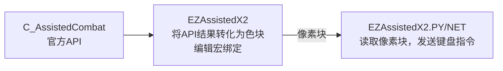
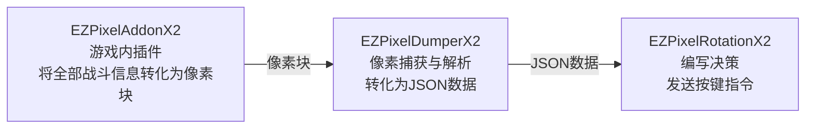

# EZWowX2

**贼心不死，继续奋斗** 💪 

一系列适用于《魔兽世界》12.0版本的非侵入性自动化辅助工具**示例**。  

---

## ⚠️ 免责声明⚠️

1. **切勿直接使用**：本项目的代码特征明显，如果大量用户使用完全相同的代码，极易被游戏反作弊系统检测并导致**账号封禁**。  
2. **必须个性化修改**：强烈建议您根据自身需求对代码进行修改和定制。调整像素布局、数据结构或通信方式，使其具备独特性。  
3. **抛砖引玉，非开箱即用**：本项目旨在展示"将游戏数据转换为像素块并通过外部程序解析"的技术思路，而非提供可直接投入使用的产品。  
4. **自行承担全部风险**：任何基于本项目的二次开发、修改或使用行为，均由您自行承担一切后果（包括但不限于账号封禁、数据损失等）。  
5. **禁止商用与损害公平**：不得将本项目用于任何商业用途，或开发损害游戏公平性的外挂/自动化工具。  

---

## ⚠️ Disclaimer⚠️

1. **Do Not Use Directly**: This project's code has distinctive characteristics; if a large number of users use exactly the same code, it is highly likely to be detected by the game's anti‑cheat system and result in **account suspension**.
2. **Personalization Required**: It is strongly recommended that you modify and customize the code according to your own needs. Adjust pixel layouts, data structures, or communication methods to make it unique.
3. **A Spark for Ideas, Not Out‑of‑the‑Box**: This project aims to demonstrate the technical concept of "converting game data into pixel blocks and parsing them via external programs," not to provide a ready‑to‑use product.
4. **Assume All Risks**: Any secondary development, modification, or use based on this project is entirely at your own risk (including but not limited to account suspension, data loss, etc.).
5. **No Commercial Use or Fair‑Play Harm**: This project must not be used for any commercial purposes, nor for developing cheats/automation tools that undermine game fairness.

## 为何采用像素方案

- 非侵入型：非侵入指未使用lua解锁或内存改写，全部基于的可视化像素读取。但注意像素自动化在暴雪 Warden 系统中仍属于"未经授权的第三方软件"。与传统内存注入外挂的唯一区别是**取证难度**（像素分析难以留痕），而非**合规性**。
- 开源**示例**：项目提供的均为开源示例，利用vibe coding技术，可以轻易重构为适合自己的版本。
- 相比于`YOLO`识别等模型方案，像素方案性能大幅领先。在Ryzen 9700X处理器上，解析速度可做到100FPS，通过限制解析速度大幅降低性能影响。血量精度1/255，时间计时精度0.1s，满足非极限需求。
- 分辨率鲁棒性：使用色块定位技术，适应不同分辨率，游戏窗口/全屏。但对`HDR`，`插帧技术`**无法适应**，需要关闭。

这里提供两套自动化辅助**示例**：

- 简易组合：基于游戏自带战斗辅助API
- 高级组合：尝试读取全部战斗信息的，从而实现自定义循环逻辑的方案

### 简易组合

- 适合做插件开发的入门示例。
- 游戏内插件为`EZAssistedX2`。
- 游戏外辅助工具为`EZAssistedX2.PY`和`EZAssistedX2.NET`，分别为Python和.net 8.0示例，功能相同。
- 该 API 仅在玩家开启"辅助战斗"（Experimental Feature）时可用，且无法获取敌方施法条、地板技能预警等关键 PvE 信息。

### 高级组合

- 可以实现在12.0版本之前的高级逻辑。
- 可满足非极限层治疗和坦克的需求。
- 兼容主机分离结构
  - 需要RGB24标准的采集卡
- 像素编码协议，详见 `EZPixelAddonX2.PY/NodeExtractorData.py`。

## 如何开始

- 使用AI IDE重构本项目，获得属于自己的代码，是规避风险的最佳且必要方法：
  - 国内用户推荐用[Lingma IDE](https://lingma.aliyun.com/)、[Kimi Code](https://www.kimi.com/code)、[Trae IDE](https://www.trae.cn/)、[CodeBuddy](https://www.codebuddy.cn/home/)等免费AI IDE。
  - 国外用户推荐用[Codex](https://openai.com/zh-Hans-CN/codex/)、[Google Antigravity](https://antigravity.google/)。
  - 已经经过测试，GLM-4.7，Kimi-2.5等非最顶级模型，足以重构后功能等价但实现差异显著，并且特征已完全打乱。
  - 使用Codex，使用token计费使用GPT-5.3-codex，重构EZPixelAddonX2、EZPixelDumperX2、EZPixelRotationX2项目，从python转为.net的总消耗约`$50`，使用coding plan将大幅低于此消耗。(供应商使用的openrouter.ai)
- AI IDE使用关键点，总的来说，类似软件工程：
  - 第一步：让AI阅读代码，要求AI**注重业务逻辑和业务细节**，针对业务逻辑，生成重构文档`rebuild.md`。
  - 第二步：让AI阅读文档`rebuild.md`，再阅读代码，找到`rebuild.md`的缺陷并改正。
  - 重复第一步和第二部，然后依次执行下面的操作，并酌情反复自查。
  - 让AI模拟`高级构架师/法务`，假设`plan.md`是给外包乙方的文档，要求补充`检查项`，写入`rebuild.md`。
  - 让AI模拟`测试`，假设`plan.md`是给外包乙方的文档，要求补充`SIT/UAT测试案例`，生成`测试案例.md`。
  - 让AI模拟`原项目职工`，对旧项目进行`SIT和UAT测试`，修正`测试案例.md`。
  - 让AI根据`rebuild.md`和`测试案例.md`生成`plan.md`
  - 让AI对`plan.md`进行`review`，查看每步操作是否都有测试。
  - 让AI`根据plan.md写代码。每执行一步，都更新plan.md`
- 上述生成文档的步骤，可以让多个模型交叉反复执行。
- 关键点：**让AI生成文档和核对文档的成本，远远低于修改代码中错误的成本**
- 关键点：**让AI反复阅读md，而不是一直生成代码，可以有效降低幻觉。**
