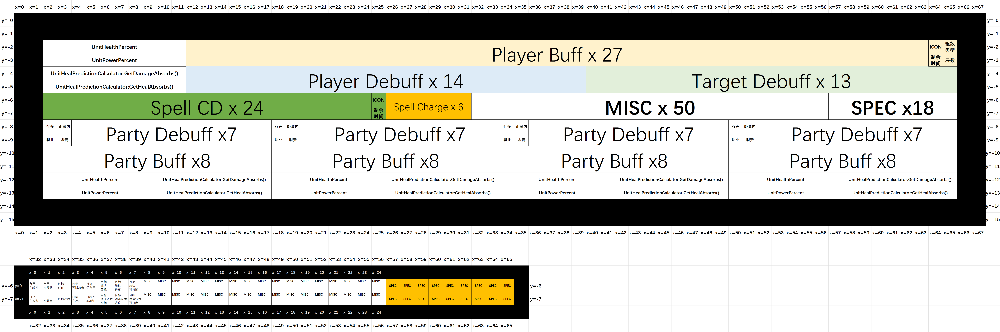

# MidnightAddon V4

贼心不死，继续奋斗

## 目前用像素布局可以实现的功能

- 玩家的基础信息
  - 当前生命值百分比 （目前精度1%，若采用渐变块，可实现1/255。）
  - 当前能量条的百分比
  - 当前伤害吸收盾占总生命值的百分比（无法使用渐变块，精度最高1%）
  - 当前治疗吸收盾占总生命值的百分比（同上，无法使用渐变块）
  - 是否在移动
  - 是否在战斗中
  - 是否在载具中
  - 是否在施法中/通道法术中
  - 施法图标/通道法术图标
  - 施法进度/通道法术进度

- 技能信息
  - 技能图标
  - 技能冷却
  - 技能充能冷却
  - 对于双层充能技能，可通过上述信息判断充能层数

- 玩家光环信息
  - 光环图标
  - 光环剩余时间的占总时间的百分比
  - 光环的可驱散类型
  - 光环的层数

- 目标信息
  - 目标的生命值百分比
  - 施法图标/通道法术图标
  - 施法进度/通道法术进度
  - 施法/通道法术是否可以打断
  - 目标是否可以工具、是否在施法范围内、是否存活etc..

- 队友信息
  - 空间恐怕不足以容纳团队成员的信息
  - 当前生命值、吸收盾，精度同玩家。
  - 适量光环信息，和玩家光环信息获取内容相同。

## V4 规划图

# V4 效果图

## V4弃坑原因

- 暂时未弃坑
