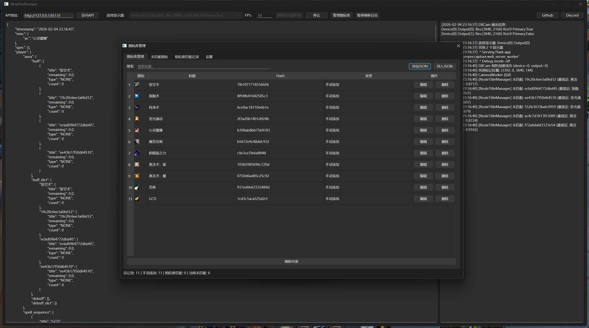

# WowPixelDumper 

**贼心不死，继续奋斗** 💪 

## 源起与目的

本项目诞生于一个简单的想法：**在12.0版本中，将秘密值通过像素化的方式传递给外部程序**。  

过去，WoW 的插件 API 提供了丰富的游戏数据，但在最新的游戏更新中，这些数据被限制为"秘密值"，无法被使用。但秘密值可以被编码为屏幕角落的彩色像素块，从而让外部程序通过屏幕捕获获取结构化信息。  

**这不是一个开箱即用的产品，而是一个技术示例。** 代码完全开源，意在展示"像素桥接"这一思路的可行性。如果你认同这个方向，建议在此基础上进行**个性化改造**——调整像素布局、修改数据结构、更换通信方式，让它成为你独有的实现。  

**如何开始？** 推荐使用 **vibe coding** 的方式：借助 AI 编程工具（如 Cline、Trae、Kimi Code、Qoder 等），让 AI 协助你理解代码逻辑并对本项目进行轻量级重构。即使你不是专业开发者，也可以通过自然语言描述需求，快速生成符合自己习惯的代码变体，从而消除本项目的可识别特征。  

项目采用 **Dumper + HTTP API** 的架构设计：Dumper 负责像素捕获与解析，通过本地 HTTP 服务（默认端口 65131）以 JSON 格式输出数据。这种解耦设计让你可以用任何熟悉的语言（Python、C#、Lua 等）独立开发后续的 Rotation 逻辑。  


---

一个用于《魔兽世界》（World of Warcraft）的**游戏数据像素化插件**，通过将游戏内的可收集信息转换为屏幕角落的像素点，让外部程序可以轻松读取并解析为结构化数据。  

> ⚠️ **重要声明**：本项目仅为技术演示和思路参考，**请勿直接在正式游戏环境中使用**，否则可能导致账号封禁。项目旨在抛砖引玉，展示一种数据提取的思路，使用者需自行承担风险。  

---

## 重要

踩坑颇多，经常重构，不要在乎git历史。现在是第7个可借鉴版本。  

---

## 🧠 工具原理

通过游戏内置 API 将各类游戏信息（生命值、技能冷却、光环效果等）渲染为屏幕角落的一系列 **8×8 像素块**，每个像素块代表一种特定信息。外部 Python 程序通过屏幕捕获读取这些像素块，利用 NumPy 进行高效处理，最终输出结构化 JSON 数据或提供 Web API 服务。  

**为什么用像素块？**  
- 易于被 `numpy` 读取为数组，避免复杂的图像识别和大模型计算  
- 性能开销极低，适合高频率刷新  
- 结构固定，解析逻辑简单可靠  

---

## 🏗️ 项目结构

```
WowPixelDumper/
├── Addons/WowPixelDumper/     # 魔兽世界插件
│   ├── WowPixelDumper.lua     # 插件主逻辑
│   ├── WowPixelDumper.toc     # 插件配置
│   ├── Setting.lua            # 设置
│   ├── Class/                 # 职业特定配置
│   │   ├── Druid.lua
│   │   └── Priest.lua
│   ├── Fonts/                 # 自定义字体（层数/充能数显示）
│   └── Libs/                  # 依赖库（LibRangeCheck等）
│
├── Dumper/                    # Python 数据提取器
│   ├── DumperGUI.py           # 程序入口
│   ├── MainWindow.py          # 主窗口（UI控制、遮挡检测）
│   ├── Worker.py              # 工作线程（CameraWorker + WebServerWorker）
│   ├── IconLibraryDialog.py   # 图标库管理对话框（4个Tab）
│   ├── Node.py                # Node + NodeExtractor（像素节点解析）
│   ├── NodeExtractorData.py   # extract_all_data + ColorMap加载
│   ├── Database.py            # NodeTitleManager（SQLite数据库、余弦相似度）
│   ├── Utils.py               # 工具函数（模板匹配、边界查找）
│   ├── test_script.py         # 功能测试脚本
│   ├── comment_deleter.py     # AST注释删除工具
│   ├── mark8.png              # 模板标记（定位像素区域）
│   ├── node_titles.db         # SQLite数据库（运行时生成）
│   └── ColorMap.json          # 颜色映射配置（职业、Buff类型等）
│
├── README.md                  # 本文件
├── CHANGELOG.md               # 更新日志
├── pyproject.toml             # Python依赖配置
└── deploy.py                  # 编译脚本
```

---

## 🚀 目前已实现的功能

###  **玩家信息**
-  当前生命值百分比（精度1/255，通过亮度值计算）
-  当前能量条百分比（通过亮度值计算）
-  伤害吸收盾占总生命值的百分比（精度1.25%）
-  治疗吸收盾占总生命值的百分比（精度1.25%）
-  是否在移动
-  是否在战斗中
-  是否在载具中
-  是否在施法/引导中
-  施法图标/引导图标
-  施法进度/引导进度
-  职业和职责（通过颜色映射）
-  死亡状态
-  等等..

###  **技能信息**
-  技能图标（通过余弦相似度识别）
-  冷却/充能冷却时间，范围1-375秒，最高精度0.05秒
-  技能充能层数（使用特殊定制字体）
-  是否高亮（技能可用提示）

###  **玩家光环（Buff/Debuff）信息**
-  光环图标
-  光环剩余时间百分比
-  光环可驱散类型（魔法、诅咒、疾病、中毒等，通过颜色映射）
-  光环层数（特殊字体）

###  **目标/焦点信息**
-  目标生命值百分比
-  施法/引导图标
-  施法/引导进度
-  施法/引导是否可以打断
-  目标是否存在、可攻击、在范围内、存活等状态

###  **队友信息**（限于屏幕空间，仅支持小队）
-  当前生命值、吸收盾（精度同玩家）
-  适量光环信息（与玩家光环获取内容相同）
-  适量其他信息（职业，距离）

###  **其他信息**
-  辅助战斗提示图标

---

## 🖼️ 界面图例



---

## 📦 安装与使用

### 1. 插件安装
将 `Addons/WowPixelDumper/` 目录复制到魔兽世界客户端的 `Interface/AddOns/` 文件夹中，启动游戏后插件将自动加载。  

### 2. Python 环境配置（Windows）

确保已安装 [uv](https://github.com/astral-sh/uv)（快速 Python 包管理器）：  

```powershell
# 安装 uv
powershell -ExecutionPolicy ByPass -c "irm https://astral.sh/uv/install.ps1 | iex"

# 同步依赖
uv sync

# 运行主程序
uv run .\Dumper\DumperGUI.py

# 编译主程序
uv run .\deploy.py
```

### 3. 首次运行

**定位像素区域：**  
Dumper 使用 `mark8.png` 作为模板标记，通过 OpenCV 模板匹配自动定位游戏内的像素数据区域。确保游戏内插件已启用且像素区域可见。

**遮挡检测：**  
程序会自动检测游戏窗口是否被遮挡（通过检查特定角点颜色），被遮挡时会提示"游戏窗口被遮挡或插件未加载"。

### 4. 图标库管理

首次运行或发现新图标时，程序会自动将未知图标存入数据库。使用**图标库管理界面**可以：

- **图标库管理 Tab**：查看所有已捕获的图标、编辑标题、删除记录、搜索过滤  
- **未匹配图标 Tab**：查看实时捕获的未识别图标，手动添加标题  
- **相似度匹配记录 Tab**：查看本会话中通过余弦相似度自动匹配的图标  
- **设置 Tab**：调整余弦相似度阈值（默认0.95，范围0.80-0.99）、查看数据库统计  

**导入/导出：**  
支持将图标库导出为 JSON 文件进行备份，或从 JSON 文件导入（支持合并或覆盖模式）。

### 5. HTTP API 服务

Dumper 内置 Flask HTTP 服务器（默认端口 **65131**），提供实时游戏数据：  

```bash
# 获取完整游戏状态（所有路径返回相同数据）
curl http://localhost:65131/
curl http://localhost:65131/api/status
curl http://localhost:65131/any/path

# 示例响应
{
  "timestamp": "2026-02-05 10:20:30",
  "player": {
    "status": {
      "health": 85.5,
      "power": 72.0,
      "in_combat": true,
      "cast_icon": "烈焰风暴",
      "cast_duration": 0.65
    },
    "spell": { ... },
    "aura": { ... }
  },
  "target": { ... },
  "focus": { ... },
  "party": { ... }
}
```

**API地址自动复制：** 点击主界面中的 API 地址输入框，内容会自动复制到剪贴板。  

**暂停刷新：** 主界面提供"暂停刷新日志"按钮，可在需要时暂停数据更新以便查看。  

---

## 🔧 开发相关

### 运行测试
```bash
cd Dumper
python test_script.py
```

### 数据流向
```
DumperGUI.py (入口)
    ↓
MainWindow.py (UI控制)
    ├── Worker.py (CameraWorker捕获)
    │       ↓
    ├── Utils.py (find_template_bounds定位)
    │       ↓
    ├── NodeExtractorData.py (extract_all_data提取)
    │       ↓
    ├── Node.py (Node解析)
    │       ↓
    ├── Database.py (NodeTitleManager标题匹配)
    │       ↓
    └── WebServerWorker (HTTP API输出)
```

### 8×8 像素节点结构

每个数据单元是一个 8×8 像素的色块，内部结构分为三层（通过内缩避免边缘模糊）：  

| 区域 | 像素范围 | 用途 |
|------|----------|------|
| `full` | 8×8 | 完整区域，用于直接截取 |
| `middle` | 6×6 (内缩1px) | 纯色判断、取色、哈希计算、白字识别 |
| `inner` | 4×4 (内缩2px) | 计算平均亮度（value值） |

### 数据布局（节点坐标）

像素数据按 8×8 节点网格排列，主要区域：  

```
玩家区域 (2,2) 开始：
- Buff序列:      x=2..29,   y=2  (28个)
- Debuff序列:    x=30..36,  y=2  (7个)
- 技能序列:      x=2..25,   y=6  (24个)
- 状态标志:      x=37..46,  y=2..5
- 血量/能量:     x=46,      y=2..3

目标区域 (47,2) 开始：
- Debuff序列:    x=47..53,  y=2  (7个)
- 施法信息:      x=39..44,  y=7

Focus区域 (47,6) 开始：
- Debuff序列:    x=47..53,  y=6  (7个)
- 施法信息:      x=39..44,  y=9

队伍区域 (12,10) 开始：
- 4个队友，每个占13列宽度
```

### 关键类说明

| 类名 | 文件 | 职责 |
|------|------|------|
| `CameraWorker` | Worker.py | DXCam 屏幕捕获工作线程，支持多显示器 |
| `WebServerWorker` | Worker.py | Flask HTTP 服务线程（端口65131） |
| `NodeExtractor` | Node.py | 像素数据提取器，提供 `node(x,y)` 链式调用 |
| `Node` | Node.py | 8×8像素节点，含颜色/亮度/哈希/标题/剩余时间属性 |
| `NodeTitleManager` | Database.py | 图标标题管理（余弦相似度匹配 + xxhash） |
| `IconLibraryDialog` | IconLibraryDialog.py | 图标库管理 GUI（4个Tab） |
| `LogEmitter` / `LogRedirector` | MainWindow.py | 日志信号系统和 print 重定向 |

### 颜色映射（ColorMap.json）

游戏内通过纯色节点传递枚举类型数据：  

- **职业（Class）**：红色=战士、粉色=圣骑士、橙色=猎人等  
- **职责（Role）**：绿色=坦克、蓝色=治疗、红色=输出  
- **Buff类型**：青色=魔法、紫色=诅咒、黄色=疾病、绿色=中毒  

---

## ⚠️ 免责声明⚠️

1. **切勿直接使用**：本项目的代码特征明显，如果大量用户使用完全相同的代码，极易被游戏反作弊系统检测并导致**账号封禁**。  
2. **必须个性化修改**：强烈建议您根据自身需求对代码进行修改和定制。调整像素布局、数据结构或通信方式，使其具备独特性。  
3. **抛砖引玉，非开箱即用**：本项目旨在展示"将游戏数据转换为像素块并通过外部程序解析"的技术思路，而非提供可直接投入使用的产品。  
4. **自行承担全部风险**：任何基于本项目的二次开发、修改或使用行为，均由您自行承担一切后果（包括但不限于账号封禁、数据损失等）。  
5. **禁止商用与损害公平**：不得将本项目用于任何商业用途，或开发损害游戏公平性的外挂/自动化工具。  

---

# English Appendix

## Origin and Purpose

This project was born from a simple idea: **In patch 12.0, pass Secret Values to external programs through pixelization**.

Previously, WoW's addon API provided abundant game data, but in the latest game updates, this data has been restricted to "Secret Values" and cannot be used. However, Secret Values can be encoded as colored pixel blocks in screen corners, allowing external programs to capture structured information through screen capture.

**This is not an out‑of‑the‑box product, but a technical demonstration.** The code is fully open‑source, aiming to showcase the feasibility of the "pixel bridge" concept. If you resonate with this direction, we recommend performing **personalized modifications** on top of it—adjust pixel layouts, modify data structures, change communication methods—to make it your own unique implementation.

**How to start?** We recommend using the **vibe coding** approach: leverage AI programming tools (like Cline, Cursor, Copilot, Antigravity, etc.) to help you understand the code logic and perform lightweight refactoring of this project. Even if you're not a professional developer, you can describe your needs in natural language and quickly generate code variants that suit your habits, thereby removing the identifiable features of this project.

The project adopts a **Dumper + HTTP API** architecture: Dumper handles pixel capture and parsing, outputting data in JSON format through a local HTTP service (default port 65131). This decoupled design allows you to independently develop subsequent Rotation logic in any language you prefer (Python, C#, Lua, etc.).

---

A **game‑data pixelization addon** for *World of Warcraft* that converts collectible information in‑game into pixel dots at screen corners, allowing external programs to easily read and parse them into structured data.

> ⚠️ **Important Notice**: This project is solely a technical demonstration and conceptual reference; **do not use it directly in a live game environment**, or it may result in account suspension. The project aims to spark ideas, showcasing a data‑extraction approach—users assume all risks.

---

## Important

Many pitfalls have been encountered, frequent refactoring occurs; don't worry about git history. This is the 7th reference‑worthy version.

---

## 🧠 How It Works

Game‑built APIs render various game information (health, skill cooldowns, aura effects, etc.) as a series of **8×8 pixel blocks** at screen corners, each block representing a specific piece of information. An external Python program captures these blocks via screen capture, processes them efficiently with NumPy, and finally outputs structured JSON data or provides a Web API service.

**Why Pixel Blocks?**  
- Easy to be read by `numpy` as arrays, avoiding complex image recognition and large‑model computation
- Extremely low performance overhead, suitable for high‑frequency refresh
- Fixed structure, simple and reliable parsing logic

---

## 🏗️ Project Structure

```
WowPixelDumper/
├── Addons/WowPixelDumper/     # WoW Addon
│   ├── WowPixelDumper.lua     # Addon main logic
│   ├── WowPixelDumper.toc     # Addon configuration
│   ├── Setting.lua            # Settings
│   ├── Class/                 # Class‑specific configuration
│   │   ├── Druid.lua
│   │   └── Priest.lua
│   ├── Fonts/                 # Custom fonts (layer/charge display)
│   └── Libs/                  # Dependency libraries (LibRangeCheck, etc.)
│
├── Dumper/                    # Python data extractor
│   ├── DumperGUI.py           # Program entry
│   ├── MainWindow.py          # Main window (UI control, occlusion detection)
│   ├── Worker.py              # Worker threads (CameraWorker + WebServerWorker)
│   ├── IconLibraryDialog.py   # Icon library management dialog (4 tabs)
│   ├── Node.py                # Node + NodeExtractor (pixel node parsing)
│   ├── NodeExtractorData.py   # extract_all_data + ColorMap loading
│   ├── Database.py            # NodeTitleManager (SQLite database, cosine similarity)
│   ├── Utils.py               # Utility functions (template matching, bounds finding)
│   ├── test_script.py         # Functional test script
│   ├── comment_deleter.py     # AST comment deletion tool
│   ├── mark8.png              # Template marker (locating pixel region)
│   ├── node_titles.db         # SQLite database (generated at runtime)
│   └── ColorMap.json          # Color mapping configuration (class, buff types, etc.)
│
├── README.md                  # This file
├── CHANGELOG.md               # Changelog
├── pyproject.toml             # Python dependency configuration
└── deploy.py                  # Build script
```

---

## 🚀 Currently Implemented Features

### **Player Information**
-  Current health percentage (precision 1/255, calculated from brightness value)
-  Current power percentage (calculated from brightness value)
-  Damage absorption shield as percentage of total health (precision 1.25%)
-  Healing absorption shield as percentage of total health (precision 1.25%)
-  Whether moving
-  Whether in combat
-  Whether in a vehicle
-  Whether casting/channeling
-  Cast icon / channel icon
-  Cast progress / channel progress
-  Class and role (via color mapping)
-  Death status
-  And more..

### **Skill Information**
-  Skill icon (identified via cosine similarity)
-  Cooldown/charge cooldown time, range 1‑375 seconds, highest precision 0.05 seconds
-  Skill charge layers (uses special custom font)
-  Whether highlighted (skill‑available indication)

### **Player Aura (Buff/Debuff) Information**
-  Aura icon
-  Aura remaining time percentage
-  Aura dispellable type (magic, curse, disease, poison, etc., via color mapping)
-  Aura layers (special font)

### **Target/Focus Information**
-  Target health percentage
-  Cast/channel icon
-  Cast/channel progress
-  Whether cast/channel can be interrupted
-  Target existence, attackable, in range, alive, etc.

### **Party Information** (limited by screen space, party only)
-  Current health, absorption shield (same precision as player)
-  Appropriate aura information (same content as player auras)
-  Appropriate other information (class, distance)

### **Other Information**
-  Auxiliary combat‑tip icons

---

## 🖼️ Interface Illustration


---

## 📦 Installation and Usage

### 1. Addon Installation
Copy the `Addons/WowPixelDumper/` directory into the `Interface/AddOns/` folder of your World of Warcraft client. The addon will load automatically when the game starts.

### 2. Python Environment Setup (Windows)

Ensure you have [uv](https://github.com/astral-sh/uv) installed (a fast Python package manager):

```powershell
# Install uv
powershell -ExecutionPolicy ByPass -c "irm https://astral.sh/uv/install.ps1 | iex"

# Sync dependencies
uv sync

# Run the main program
uv run .\Dumper\DumperGUI.py

# Build the main program
uv run .\deploy.py
```

### 3. First Run

**Locating the Pixel Region:**  
Dumper uses `mark8.png` as a template marker, automatically locating the pixel‑data region in‑game via OpenCV template matching. Ensure the addon is enabled in‑game and the pixel region is visible.

**Occlusion Detection:**  
The program automatically detects whether the game window is occluded (by checking specific corner‑point colors) and will prompt "Game window is occluded or addon not loaded" when occluded.

### 4. Icon Library Management

On first run or when new icons are discovered, the program automatically stores unknown icons in the database. Using the **icon library management interface** you can:

- **Icon Library Tab**: View all captured icons, edit titles, delete records, search and filter
- **Unmatched Icons Tab**: View real‑time captured unidentified icons, manually add titles
- **Similarity‑match Records Tab**: View icons automatically matched via cosine similarity in this session
- **Settings Tab**: Adjust cosine‑similarity threshold (default 0.95, range 0.80‑0.99), view database statistics

**Import/Export:**  
Supports exporting the icon library as a JSON file for backup, or importing from a JSON file (supports merge or overwrite modes).

### 5. HTTP API Service

Dumper includes a built‑in Flask HTTP server (default port **65131**) that provides real‑time game data:

```bash
# Get full game status (all paths return the same data)
curl http://localhost:65131/
curl http://localhost:65131/api/status
curl http://localhost:65131/any/path

# Example response
{
  "timestamp": "2026-02-05 10:20:30",
  "player": {
    "status": {
      "health": 85.5,
      "power": 72.0,
      "in_combat": true,
      "cast_icon": "Firestorm",
      "cast_duration": 0.65
    },
    "spell": { ... },
    "aura": { ... }
  },
  "target": { ... },
  "focus": { ... },
  "party": { ... }
}
```

**API Address Auto‑copy**: Clicking the API address input box in the main interface will automatically copy its contents to the clipboard.

**Pause Refresh**: The main interface provides a "Pause Refresh Log" button that can pause data updates when needed for inspection.

---

## 🔧 Development Information

### Running Tests
```bash
cd Dumper
python test_script.py
```

### Data Flow
```
DumperGUI.py (Entry)
    ↓
MainWindow.py (UI Control)
    ├── Worker.py (CameraWorker Capture)
    │       ↓
    ├── Utils.py (find_template_bounds Locating)
    │       ↓
    ├── NodeExtractorData.py (extract_all_data Extraction)
    │       ↓
    ├── Node.py (Node Parsing)
    │       ↓
    ├── Database.py (NodeTitleManager Title Matching)
    │       ↓
    └── WebServerWorker (HTTP API Output)
```

### 8×8 Pixel Node Structure

Each data unit is an 8×8 pixel color block with a three‑layer internal structure (inset to avoid edge blurring):

| Area | Pixel Range | Purpose |
|------|----------|------|
| `full` | 8×8 | Full area, used for direct capture |
| `middle` | 6×6 (inset 1px) | Solid‑color judgment, color extraction, hash calculation, white‑character recognition |
| `inner` | 4×4 (inset 2px) | Calculate average brightness (value) |

### Data Layout (Node Coordinates)

Pixel data is arranged in an 8×8 node grid, with main regions:

```
Player Region starting at (2,2):
- Buff sequence: x=2..29, y=2 (28 items)
- Debuff sequence: x=30..36, y=2 (7 items)
- Skill sequence: x=2..25, y=6 (24 items)
- Status flags: x=37..46, y=2..5
- Health/power: x=46, y=2..3

Target Region starting at (47,2):
- Debuff sequence: x=47..53, y=2 (7 items)
- Casting info: x=39..44, y=7

Focus Region starting at (47,6):
- Debuff sequence: x=47..53, y=6 (7 items)
- Casting info: x=39..44, y=9

Party Region starting at (12,10):
- 4 party members, each occupies 13 column width
```

### Key Classes

| Class | File | Responsibilities |
|------|------|------|
| `CameraWorker` | Worker.py | DXCam screen‑capture worker thread, supports multiple displays |
| `WebServerWorker` | Worker.py | Flask HTTP service thread (port 65131) |
| `NodeExtractor` | Node.py | Pixel data extractor, provides `node(x,y)` chained calls |
| `Node` | Node.py | 8×8 pixel node, containing color/brightness/hash/title/remaining‑time attributes |
| `NodeTitleManager` | Database.py | Icon title management (cosine‑similarity matching + xxhash) |
| `IconLibraryDialog` | IconLibraryDialog.py | Icon library management GUI (4 tabs) |
| `LogEmitter` / `LogRedirector` | MainWindow.py | Log signal system and print redirection |

### Color Mapping (ColorMap.json)

In‑game, enumeration‑type data is transmitted via solid‑color nodes:

- **Class**: Red = Warrior, Pink = Paladin, Orange = Hunter, etc.
- **Role**: Green = Tank, Blue = Healer, Red = DPS
- **Buff Types**: Cyan = Magic, Purple = Curse, Yellow = Disease, Green = Poison

---

## ⚠️ Disclaimer⚠️

1. **Do Not Use Directly**: This project's code has distinctive characteristics; if a large number of users use exactly the same code, it is highly likely to be detected by the game's anti‑cheat system and result in **account suspension**.
2. **Personalization Required**: It is strongly recommended that you modify and customize the code according to your own needs. Adjust pixel layouts, data structures, or communication methods to make it unique.
3. **A Spark for Ideas, Not Out‑of‑the‑Box**: This project aims to demonstrate the technical concept of "converting game data into pixel blocks and parsing them via external programs," not to provide a ready‑to‑use product.
4. **Assume All Risks**: Any secondary development, modification, or use based on this project is entirely at your own risk (including but not limited to account suspension, data loss, etc.).
5. **No Commercial Use or Fair‑Play Harm**: This project must not be used for any commercial purposes, nor for developing cheats/automation tools that undermine game fairness.